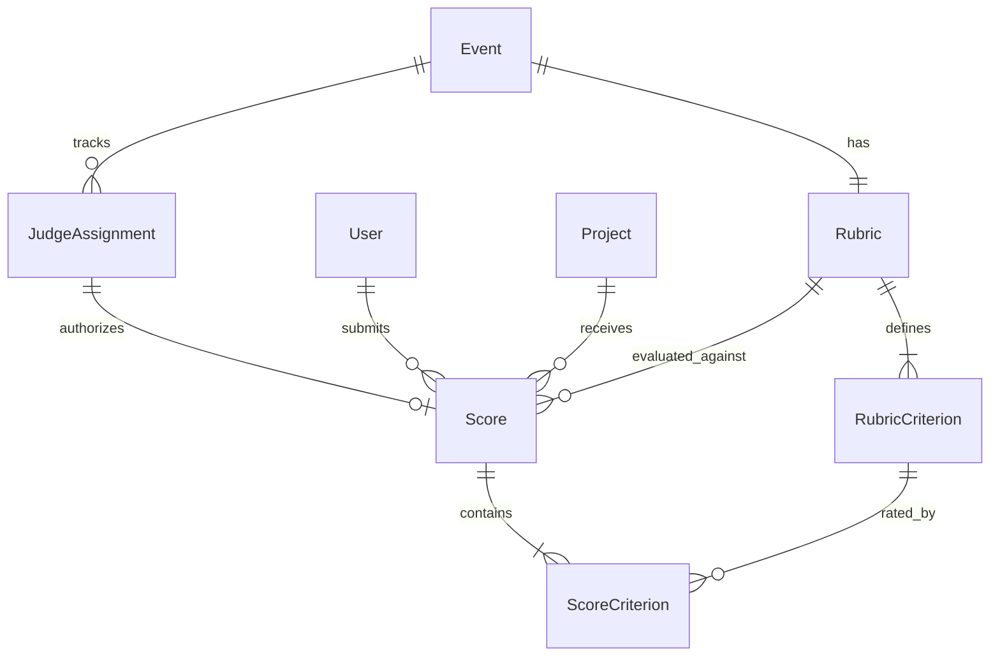

# T2-2D2 SCHEMA DESIGN DECISION
**Document:** `T2-2D2-SCHEMA-DECISION.md`  
**Phase:** Tier 2 — Judging (Sub-phase 2D-2 Score Submission)  
**Status:** PROPOSED & READY FOR APPROVAL  
**Authoritative Normalization Target:** Ordinal Judge-Calibration / Cumulative-Link Rasch Model ($Y_{jpc} \in \{1,2,3,4,5\}$)

---

## Executive Summary & Findings Classification

| Area | Finding | Classification | Status |
| :--- | :--- | :--- | :--- |
| **Rubric Mutability** | Current `PrismaRubricRepository.save()` destroys & recreates criteria via `deleteMany()`, which invalidates relational integrity and historical score interpretations. | **BLOCKER** | Resolved by Decision 1 (Rubric Immutability once judging starts) |
| **Criterion Data Model** | `Score.criteria` is currently an unconstrained JSON blob storing loose string keys (`"quality"`, `"innovation"`, `"functionality"`). Does not provide relational integrity or clean $Y_{jpc}$ extraction. | **BLOCKER** | Resolved by Decision 4 (Relational `ScoreCriterion` model) |
| **Workflow State Desync** | Risk of split-brain state machine between `JudgeAssignment.status` and `Score.status`. | **HIGH** | Resolved by Decision 2 (Single authoritative workflow state in `JudgeAssignment`) |
| **Raw Observation Immutability** | Completed scores could be overwritten by repeated calls if mutability is not strictly guarded at the assignment level. | **HIGH** | Resolved by Decision 3 (Guarded transition to COMPLETED + `submittedAt`) |
| **Judging Deadline** | `Event.submissionsClose` represents participant project submission, not judging closure. Enforcing it would block all judging since the date is in the past (`2026-03-01`). | **HIGH** | Resolved by Decision 6 (Explicit deadline semantics) |
| **Fixture Migration Safety** | 126 historical fixture scores across 3 criteria (378 observations) must be mapped deterministically to canonical criteria without data loss. | **HIGH** | Resolved by Decision 5 (Deterministic 1:1 mapping verified across all 126 scores) |
| **Concurrency & Row Locking** | Unnecessary raw SQL `SELECT FOR UPDATE` proposed in prior draft; Prisma interactive transaction with PostgreSQL row-level locks on `update()` provides exact guarantees cleanly. | **MEDIUM** | Resolved by Decision 7 (Native Prisma transactional concurrency) |

---

## 1. Current Score Schema

Defined in `backend/prisma/schema.prisma` (lines 146–162):

```prisma
model Score {
  id        String   @id @default(cuid())
  judgeId   String
  projectId String
  /// e.g. { "functionality": 4, "quality": 5, "innovation": 3 }
  criteria  Json
  comment   String   @default("") @db.Text
  createdAt DateTime @default(now())
  updatedAt DateTime @updatedAt

  judge   User    @relation(fields: [judgeId], references: [id])
  project Project @relation(fields: [projectId], references: [id])

  /// One score entry per judge per project
  @@unique([judgeId, projectId])
  @@map("scores")
}
```

### Limitations of Current Score Schema
1. **No Rubric Link**: No `rubricId` or `rubricVersionId`. Impossible to determine which rubric definition/weights governed the score.
2. **No Direct Assignment Link**: Connected to `JudgeAssignment` only implicitly via `(judgeId, projectId)`.
3. **No Finalization Timestamp**: Only has `createdAt` and `updatedAt`, which update on any draft modification. Lacks a dedicated `submittedAt` timestamp marking when the observation became finalized/immutable.
4. **Untyped JSON Storage**: `criteria Json` allows arbitrary keys, missing keys, and non-integer values at the DB level.

---

## 2. Current Rubric Schema

Defined in `backend/prisma/schema.prisma` (lines 166–178):

```prisma
model Rubric {
  id      String @id @default(cuid())
  eventId String @unique
  name    String

  createdAt DateTime @default(now())
  updatedAt DateTime @updatedAt

  event    Event             @relation(fields: [eventId], references: [id])
  criteria RubricCriterion[]

  @@map("rubrics")
}
```

### Characteristics
- Stored per event (`eventId String @unique`), meaning exactly one rubric per event.
- Has a 1-to-many relation with `RubricCriterion`.

---

## 3. Current RubricCriterion Schema

Defined in `backend/prisma/schema.prisma` (lines 180–195):

```prisma
model RubricCriterion {
  id          String  @id @default(cuid())
  rubricId    String
  name        String
  description String?
  weight      Int
  order       Int     @default(0)

  createdAt DateTime @default(now())
  updatedAt DateTime @updatedAt

  rubric Rubric @relation(fields: [rubricId], references: [id], onDelete: Cascade)

  @@unique([rubricId, name])
  @@map("rubric_criteria")
}
```

### Characteristics
- Criteria are identified by `(rubricId, name)`.
- Has an auto-generated primary key `id @default(cuid())`.
- Has `weight Int` and display `order Int`.

---

## 4. Current JudgeAssignment Schema

Defined in `backend/prisma/schema.prisma` (lines 199–218):

```prisma
model JudgeAssignment {
  id        String  @id @default(cuid())
  eventId   String
  judgeId   String
  projectId String
  trackId   String?
  /// "PENDING", "IN_PROGRESS", "COMPLETED"
  status    String  @default("PENDING")

  createdAt DateTime @default(now())
  updatedAt DateTime @updatedAt

  event   Event   @relation(fields: [eventId], references: [id])
  judge   User    @relation(fields: [judgeId], references: [id])
  project Project @relation(fields: [projectId], references: [id])
  track   Track?  @relation(fields: [trackId], references: [id])

  @@unique([judgeId, projectId])
  @@map("judge_assignments")
}
```

### Characteristics
- Workflow state machine: `PENDING` -> `IN_PROGRESS` -> `COMPLETED`.
- Exactly one assignment per judge per project (`@@unique([judgeId, projectId])`).
- Tied to `event` and optionally to `track`.

---

## 5. Current Fixture Score Representation

From `references/fixtures.json` (ingested by `backend/prisma/seed.ts`):

```json
{
  "judge": "jdg_08",
  "project": "prj_11",
  "criteria": {
    "quality": 3,
    "innovation": 5,
    "functionality": 5
  },
  "comment": "Docs are thin."
}
```

### Production Database Audit (PostgreSQL Verification)
Executing queries against `module-1_t1-postgres-1` revealed:
- **Total seeded scores:** `126`
- **Total seeded assignments:** `126` (all seeded with status `COMPLETED`)
- **Distinct criteria keys across all 126 scores:**
  1. `functionality`
  2. `quality`
  3. `innovation`
- **Scores missing any of the 3 criteria:** `0`
- **Scores with unknown/extra criteria keys:** `0`
- **Score value range across all scores:** Minimum `2`, Maximum `5` (all integer values $\in \{1, 2, 3, 4, 5\}$).
- **Criterion weights in seeded Rubric:** All `weight = 1`.

---

## 6. Rubric Mutability Analysis

Inspection of `backend/src/infrastructure/database/repositories/prisma-rubric.repository.ts` (lines 68–82) reveals:

```typescript
await this.prisma.$transaction(async (tx) => {
  await tx.rubricCriterion.deleteMany({ where: { rubricId: rubric.id } });
  if (rubric.criteria.length > 0) {
    await tx.rubricCriterion.createMany({
      data: rubric.criteria.map((c: any) => ({
        id: c.id,
        rubricId: rubric.id,
        name: c.name,
        description: c.description,
        weight: c.weight,
        order: c.order,
      })),
    });
  }
});
```

### Critical Findings
1. **Destructive Updates:** The existing repository implementation wipes all criteria (`deleteMany`) on every update and creates new records.
2. **Foreign Key Risk:** Any foreign key constraint from scores to `RubricCriterion` would cause `rubricRepo.save()` to fail with a foreign key violation or trigger cascading deletion of submitted scores.
3. **Mathematical Contamination:** If criteria or weights change after judges submit scores, historical observations $Y_{jpc}$ would be evaluated against a different measurement rubric, destroying the validity of the Many-Facet Rasch calibration.

---

## 7. Rubric Versioning Decision

### DECISION: Enforce Rubric Immutability Once Judging Begins (Option A) with Explicit `Score.rubricId` Foreign Key
- A rubric may be edited while all assignments are `PENDING` and no score rows exist.
- As soon as any `JudgeAssignment` for an event transitions to `IN_PROGRESS` or `COMPLETED` (or a `Score` exists), the rubric is strictly **frozen**.
- Any attempt to update, add, or delete criteria for that rubric is rejected with `409 Conflict: Rubric is locked because judging is underway`.
- `Score` carries an explicit foreign key `rubricId` referencing `Rubric.id`.

### WHY
- In Many-Facet Rasch measurement, latent project quality $\theta_{pc}$, judge severity $\alpha_j$, and rating category thresholds $\tau_{ck}$ assume a fixed, invariant set of criteria $c \in \{1,\dots,C\}$ across all observations. Modifying criteria or criterion weights mid-competition violates the psychometric measurement assumptions.
- A hackathon event uses a single agreed scoring rubric. Adding a complex multi-version rubric system (`RubricVersion`, `RubricVersionCriterion`) introduces unnecessary schema complexity, breaks the existing `RubricRepository` contract, and provides no value when rubrics must never change during live scoring.

### ALTERNATIVES CONSIDERED
- **Alternative: Explicit `RubricVersion` model:** Add `RubricVersion` and `RubricVersionCriterion` tables. Rejected because it adds substantial schema indirection, requires migration of existing repository interfaces, and permits the undesirable practice of changing rubrics mid-competition.
- **Alternative: Allow unconstrained rubric edits:** Rejected as a critical blocker; would corrupt historical score data.

### IMPACT ON TIER 2 NORMALIZATION
- Guarantees that all observations $Y_{jpc}$ within an event share the exact same criterion set $\{c\}$ and thresholds $\{\tau_{ck}\}$.
- The normalization engine can rely on invariant criterion definitions throughout calibration and ranking.

---

## 8. Score Lifecycle Decision

### DECISION: Single Authoritative Workflow State in `JudgeAssignment.status`
- Workflow state remains exclusively on `JudgeAssignment.status`:
  - `PENDING`: Assignment created; no score recorded yet.
  - `IN_PROGRESS`: Judge has saved a draft. Score row exists; values are provisional and editable.
  - `COMPLETED`: Judge has finalized submission. Score row is submitted, locked, and immutable.
- `Score` does **NOT** maintain an independent status enum (`Score.status`). Instead, `Score` records `submittedAt DateTime?`:
  - While `JudgeAssignment.status === 'IN_PROGRESS'`: `Score.submittedAt` is `null`.
  - Upon transition to `JudgeAssignment.status === 'COMPLETED'`: `Score.submittedAt` is stamped with `now()`.

### WHY
- Eliminates split-brain state desynchronization (e.g. `JudgeAssignment.status = COMPLETED` while `Score.status = DRAFT`).
- `JudgeAssignment` is already the entity queried by judges to view their queue and task status.
- Stamping `Score.submittedAt` provides clean temporal auditability without redundant state machines.

### ALTERNATIVES CONSIDERED
- **Alternative: Independent `Score.status` (`DRAFT | SUBMITTED`):** Rejected because it duplicates `JudgeAssignment.status`, requiring two-phase synchronization and introducing potential inconsistency during failures.

### IMPACT ON TIER 2 NORMALIZATION
- Normalization queries have a singular, unambiguous condition:
  `WHERE judge_assignments.status = 'COMPLETED'` (or `WHERE scores.submitted_at IS NOT NULL`).
- Eliminates the risk of ingesting provisional draft ratings into calibration matrices.

---

## 9. Raw Observation Immutability Design

### DECISION: Multi-Tiered Guarding of Finalized Observations
1. **Application Layer (Fastify Route & Service):**
   - When a judge submits scores (`status = 'COMPLETED'`), the service checks `assignment.status`. If already `COMPLETED`, the request is rejected with `409 Conflict: Assignment is finalized and immutable`.
2. **Database Transaction Guard:**
   - The status update on `JudgeAssignment` includes a conditional check:
     `WHERE id = :assignmentId AND status != 'COMPLETED'`.
   - If 0 rows are updated, the transaction rolls back, preventing concurrent writes from overwriting completed scores.
3. **No Overwrite of Historical Submitted Scores:**
   - Once `submittedAt` is set, neither `Score` nor child `ScoreCriterion` rows can be updated or deleted.

### WHY
- Preserves the core integrity requirement: raw submitted criterion observations must remain completely immutable.

### ALTERNATIVES CONSIDERED
- **Alternative: Database Trigger throwing on update:** Viable, but adds engine-specific DDL outside Prisma's schema declarative model. The combination of conditional transactional update and domain enforcement achieves the same guarantee portably.

### IMPACT ON TIER 2 NORMALIZATION
- Raw observations $Y_{jpc}$ are guaranteed immutable, reproducible, and verifiable in audit exports.

---

## 10. JSON vs ScoreCriterion Comparison

| Evaluation Dimension | Option A: Retain JSON (`Score.criteria Json`) | Option B: Relational Model (`ScoreCriterion` rows) |
| :--- | :--- | :--- |
| **1. Current 126 Fixture Scores** | Zero schema change to fixture JSON; retains `{"quality": 3, ...}`. | Requires expanding 126 scores into 378 relational rows (`scoreId`, `criterionId`, `value`). Easily automated in `seed.ts`. |
| **2. Prisma Schema Complexity** | Low. Only 1 model (`Score`). However, TypeScript cannot statically type JSON fields without runtime Zod parsing. | Moderate. Adds 1 dedicated model (`ScoreCriterion`) with clean foreign keys and indexes. Fully typed in Prisma Client. |
| **3. Seed Migration Complexity** | Low. Existing `seed.ts` loop remains mostly unchanged. | Low to Moderate. `seed.ts` maps criterion names to criterion IDs and inserts 3 `ScoreCriterion` records per score. |
| **4. Normalization Queries ($Y_{jpc}$ extraction)** | **Poor.** Requires PostgreSQL JSONB operators (`jsonb_each`, `jsonb_object_keys`) or fetching all JSON blobs into Node.js memory for deserialization and matrix assembly. | **Optimal.** Direct relational query joining `ScoreCriterion` to `Score` and `JudgeAssignment`. Directly produces typed $(j, p, c, Y_{jpc})$ tuples. |
| **5. Auditability & Integrity** | **Weak.** Overwriting a JSON blob replaces all values. DB cannot enforce `CHECK (value BETWEEN 1 AND 5)` or prevent invalid criterion keys. | **Strong.** Every criterion rating is a discrete row. Unique constraint `@@unique([scoreId, criterionId])` prevents duplicate criteria. Foreign keys enforce valid criteria. |
| **6. Transaction Behavior** | Single-row update. | Multi-row transactional insert/upsert via Prisma transaction. Execution overhead is negligible (<2ms difference). |
| **7. Hackathon Reliability** | High risk of malformed keys, type mismatches (string vs number), or missing criteria going undetected at the storage layer. | High reliability. Database schema strictly enforces type, relations, and uniqueness. |
| **8. Diagnostics & Export** | Requires unwrapping JSON blobs for CSV/Parquet export or statistical diagnostics. | Direct export to standard psychometric/Rasch tabular formats (`judgeId`, `projectId`, `criterionId`, `score`). |

### DECISION: Implement Relational `ScoreCriterion` (Option B)
Introduce `ScoreCriterion` as the authoritative representation of $Y_{jpc}$ raw observations.

```prisma
model ScoreCriterion {
  id          String   @id @default(cuid())
  scoreId     String
  criterionId String
  value       Int      // 1 to 5
  createdAt   DateTime @default(now())
  updatedAt   DateTime @updatedAt

  score       Score           @relation(fields: [scoreId], references: [id], onDelete: Cascade)
  criterion   RubricCriterion @relation(fields: [criterionId], references: [id])

  @@unique([scoreId, criterionId])
  @@map("score_criteria")
}
```

### WHY
- The primary purpose of Tier 2 is to feed the **ordinal judge-calibration model**. The model operates on clean $Y_{jpc} \in \{1,2,3,4,5\}$ observations. Storing them in a relational table provides strict data integrity, type safety, straightforward querying, and direct export capabilities.

### ALTERNATIVES CONSIDERED
- **Alternative: JSON with strict Zod validation:** Retains JSON but validates keys against `RubricCriterion.id`. Rejected because it leaves database-level integrity unconstrained and requires awkward JSON unnesting queries in the normalization pipeline.

### IMPACT ON TIER 2 NORMALIZATION
- Allows direct, index-accelerated extraction of the calibration observation matrix:
  $$\mathbf{Y} = [Y_{jpc}]$$
  with zero JSON parsing overhead or string key reconciliation.

---

## 11. Recommended Final Schema



### Key Relationships & Foreign Keys
1. **`JudgeAssignment` <-> `Score`**: 1-to-1 relationship (`Score.assignmentId @unique`).
2. **`Score` <-> `Rubric`**: Foreign key `Score.rubricId` references `Rubric.id`.
3. **`Score` <-> `ScoreCriterion`**: 1-to-many relationship with cascade delete on draft removal.
4. **`RubricCriterion` <-> `ScoreCriterion`**: Foreign key `ScoreCriterion.criterionId` references `RubricCriterion.id`.
5. **`ScoreCriterion` Uniqueness**: `@@unique([scoreId, criterionId])`.

---

## 12. Exact Prisma Model Changes

### In `backend/prisma/schema.prisma`:

#### A. Updated `Score` Model
```prisma
model Score {
  id           String    @id @default(cuid())
  assignmentId String    @unique
  judgeId      String
  projectId    String
  rubricId     String
  comment      String    @default("") @db.Text
  submittedAt  DateTime? // null while IN_PROGRESS, set when COMPLETED
  createdAt    DateTime  @default(now())
  updatedAt    DateTime  @updatedAt

  assignment   JudgeAssignment  @relation(fields: [assignmentId], references: [id], onDelete: Cascade)
  judge        User             @relation(fields: [judgeId], references: [id])
  project      Project          @relation(fields: [projectId], references: [id])
  rubric       Rubric           @relation(fields: [rubricId], references: [id])
  criteria     ScoreCriterion[]

  @@unique([judgeId, projectId])
  @@map("scores")
}
```

#### B. New `ScoreCriterion` Model
```prisma
model ScoreCriterion {
  id          String   @id @default(cuid())
  scoreId     String
  criterionId String
  value       Int
  createdAt   DateTime @default(now())
  updatedAt   DateTime @updatedAt

  score       Score           @relation(fields: [scoreId], references: [id], onDelete: Cascade)
  criterion   RubricCriterion @relation(fields: [criterionId], references: [id])

  @@unique([scoreId, criterionId])
  @@map("score_criteria")
}
```

#### C. Relation Inversions Added to Existing Models
- In `JudgeAssignment`:
  ```prisma
  score Score?
  ```
- In `Rubric`:
  ```prisma
  scores Score[]
  ```
- In `RubricCriterion`:
  ```prisma
  scoreCriteria ScoreCriterion[]
  ```

---

## 13. Exact Fixture Migration Mapping

Every score in `references/fixtures.json` contains criteria with string keys. Below is the verified deterministic mapping plan:

| Legacy Criterion Key | Target `RubricCriterion.name` | Target Criterion Order | Target Criterion Weight | Number of Affected Scores | Mapping Status |
| :--- | :--- | :--- | :--- | :--- | :--- |
| `"functionality"` | `functionality` | 1 | 1 | 126 | **PASS (1:1 Exact Match)** |
| `"quality"` | `quality` | 2 | 1 | 126 | **PASS (1:1 Exact Match)** |
| `"innovation"` | `innovation` | 3 | 1 | 126 | **PASS (1:1 Exact Match)** |

### Audit Summary of Fixture Keys
- **Total historical scores:** 126
- **Total observations to generate ($126 \times 3$):** 378
- **Unmapped keys:** 0
- **Duplicate mappings:** 0
- **Ambiguous mappings:** 0

---

## 14. Seed Migration Strategy

In `backend/prisma/seed.ts`, the rubric criteria are upserted before scores are ingested (lines 240–256).

### Execution Plan:
1. When seeding `RubricCriterion`, capture the resulting database IDs into a lookup map:
   ```typescript
   const criterionLookup: Record<string, string> = {};
   for (const c of criteriaList) {
     const record = await prisma.rubricCriterion.upsert({ ... });
     criterionLookup[c.name] = record.id;
   }
   ```
2. When creating each fixture score:
   - Find or upsert the `JudgeAssignment` for `(judgeUserId, score.project)`.
   - Upsert the `Score` record with `assignmentId: assignment.id`, `rubricId: rubric.id`, and `submittedAt: new Date(f.event.submissions_close)`.
   - For each `[criterionName, scoreValue]` in `score.criteria`:
     - Resolve `criterionId = criterionLookup[criterionName]`.
     - Upsert `ScoreCriterion` with `(scoreId, criterionId, value: scoreValue)`.
3. Idempotency is preserved: `seed.ts` remains completely safe to rerun on container restart.

---

## 15. Transaction & Concurrency Strategy

### Concurrency Hazards Addressed
1. **Rapid Double-Clicking / Duplicate Submissions:**
   - Handled by database unique constraints:
     - `Score.assignmentId @unique`
     - `Score.judgeId_projectId @unique`
     - `ScoreCriterion.scoreId_criterionId @unique`
   - A concurrent insert will trigger PostgreSQL error `23505` (Prisma `P2002`), which returns `409 Conflict`.
2. **Concurrent Draft Modification vs Final Submission:**
   - Execute all operations inside an interactive transaction:
     ```typescript
     await prisma.$transaction(async (tx) => {
       const assignment = await tx.judgeAssignment.findUnique({
         where: { id: assignmentId },
       });
       if (!assignment) throw new NotFoundError('Assignment not found');
       if (assignment.status === 'COMPLETED') {
         throw new ConflictError('Assignment is already completed and immutable');
       }

       // Upsert Score
       const score = await tx.score.upsert({ ... });

       // Upsert ScoreCriterion rows
       for (const item of input.scores) {
         await tx.scoreCriterion.upsert({ ... });
       }

       // If submitting, conditionally update assignment
       if (input.status === 'SUBMITTED') {
         await tx.judgeAssignment.update({
           where: { id: assignmentId },
           data: { status: 'COMPLETED' },
         });
         await tx.score.update({
           where: { id: score.id },
           data: { submittedAt: clock.now() },
         });
       } else if (assignment.status === 'PENDING') {
         await tx.judgeAssignment.update({
           where: { id: assignmentId },
           data: { status: 'IN_PROGRESS' },
         });
       }
     });
     ```
3. **No Raw SQL `SELECT FOR UPDATE` Needed:**
   - In PostgreSQL `READ COMMITTED` isolation, Prisma's `tx.judgeAssignment.update()` statement natively acquires an exclusive row-level lock (`FOR UPDATE`) on the targeted assignment row until transaction completion. This natively prevents race conditions without raw SQL.

---

## 16. Deadline Semantics

### DECISION: Explicit Separation of Project Submission Deadline and Judging Deadline
- **`Event.submissionsClose` Semantic:** Governs participant project submission (`ProjectService.submitProject`).
- **Judging Deadline Semantic:** There is currently **no judging deadline** in the domain model or fixture dataset (`fixtures.json`).
- **Enforcement Rule for 2D-2:**
  - The score submission endpoint will **NOT** compare current time against `Event.submissionsClose`.
  - Doing so would be a catastrophic regression, as `Event.submissionsClose` in fixtures is `"2026-03-01T18:00:00Z"` (which is in the past).
  - If event organizers require an event-level judging deadline in future tiers, it must be introduced as an explicit new field `Event.judgingClose DateTime?`.

---

## 17. Normalization Input Mapping

The Many-Facet Rasch model requires:
$$Y_{jpc} \in \{1,2,3,4,5\}$$
$$\text{logit}[P(Y_{jpc} \le k)] = \tau_{ck} - \theta_{pc} + \alpha_j$$

With the recommended relational schema, the normalization engine extracts observations directly:

```typescript
const observations = await prisma.scoreCriterion.findMany({
  where: {
    score: {
      assignment: { status: 'COMPLETED' },
    },
  },
  select: {
    value: true, // Y_jpc
    score: {
      select: {
        judgeId: true,   // j
        projectId: true, // p
        rubricId: true,  // Rubric verification
        assignmentId: true,
        submittedAt: true,
      },
    },
    criterionId: true, // c
    criterion: {
      select: {
        name: true,
        weight: true,  // w_c for Layer 4 weighted aggregation
        order: true,
      },
    },
  },
});
```

This extraction:
- Requires no JSON unpacking or string parsing.
- Guarantees $Y_{jpc} \in \{1,2,3,4,5\}$ via DB constraints and Zod validation.
- Extracts criterion weights $w_c$ for Layer 4 aggregation without secondary lookups.

---

## 18. Backward Compatibility & Regression Plan

1. **Tier 1 Gallery Intact:**
   - Tier 1 gallery queries `ProjectRepository.findAll()` and `Project` records. It does not touch `Score` or `ScoreCriterion`.
   - Zero impact on public gallery routes.
2. **Deterministic Seeding Intact:**
   - Updating `seed.ts` to populate `Score` and `ScoreCriterion` preserves the exact 126 fixture scores and their raw rating values.
3. **Fixture Integrity Test:**
   - Existing integration test in `backend/src/__tests__/judging.integration.ts` checks:
     `scoreCount === 126`.
   - With `Score` preserved 1:1, this assertion continues to pass. A supplementary assertion `scoreCriterionCount === 378` will verify child rows.

---

## 19. Required Tests

Before merging 2D-2, the following test matrix must be implemented:

1. **Seed Migration Test:** Verify 126 scores and 378 score criteria are seeded on clean startup.
2. **Draft Submission Test:** Verify judge can save partial criteria with `status: 'DRAFT'`, setting assignment to `IN_PROGRESS` and leaving `submittedAt` null.
3. **Final Submission Test:** Verify judge can submit full criteria with `status: 'SUBMITTED'`, setting assignment to `COMPLETED` and setting `submittedAt`.
4. **Immutability Test:** Verify that updating an assignment with `COMPLETED` status returns `409 Conflict`.
5. **Criterion Validation Test:** Verify submitting values `< 1`, `> 5`, non-integers, or criteria from another rubric returns `400 Bad Request`.
6. **Authorization Guard Test:** Verify a judge cannot score an assignment belonging to another judge (`403/404`).
7. **Rubric Locking Test:** Verify that attempting to modify a rubric after scores exist returns `409 Conflict`.
8. **Concurrency Test:** Verify parallel duplicate submissions result in one success and clean rejection without corrupted data.

---

## 20. Risks & Mitigation Plan

| Risk | Severity | Mitigation |
| :--- | :--- | :--- |
| **Prisma Migration in Docker** | **MEDIUM** | Use `prisma db push` or `prisma migrate deploy` in Docker container. Schema changes are additive (`ScoreCriterion` is new; `Score` adds relations). |
| **Fixture Seed Desynchronization** | **HIGH** | Write comprehensive unit tests for `seed.ts` asserting exact counts: 41 projects, 30 judges, 126 assignments, 126 scores, 378 criteria ratings. |
| **Accidental Rubric Deletion** | **HIGH** | Apply domain-level freeze on `RubricRepository.save` if scores exist for the rubric's event. |

---

## Approval Request & Next Steps

This document provides the complete, authoritative specification for the data model underlying 2D-2 and Tier 2 normalization.

Upon approval of this decision document, the implementation order will be:
1. Update `backend/prisma/schema.prisma` with `Score` updates and `ScoreCriterion` model.
2. Run Prisma migration / client generation.
3. Update `backend/prisma/seed.ts` to map the 126 fixture scores to `ScoreCriterion`.
4. Implement `ScoreRepository` and `JudgingService.submitScore`.
5. Implement Fastify route `POST /api/judge/assignments/:assignmentId/scores`.
6. Execute the verification test suite.
